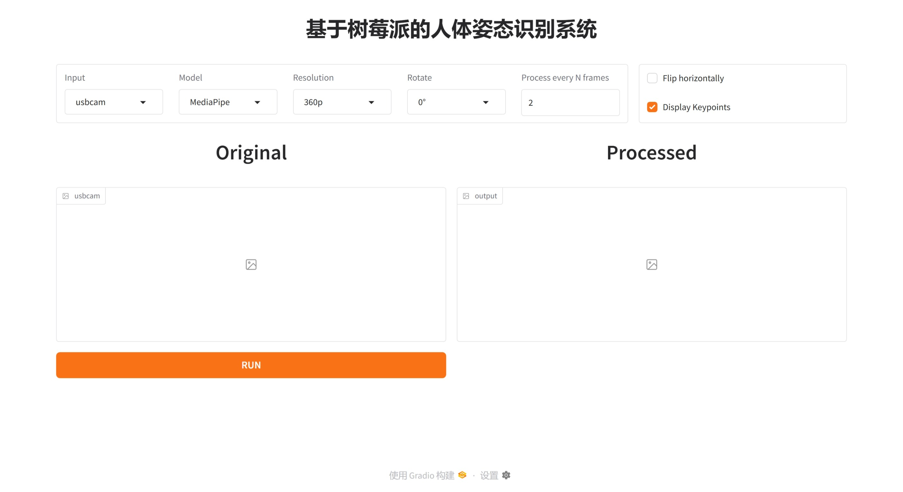

# 基于树莓派的人体姿态识别系统

## 项目介绍



本项目是一套基于[MediaPipe](https://ai.google.dev/edge/mediapipe/solutions/vision/pose_landmarker)构建的人体姿态识别系统，实际运行在树莓派5上，理论上支持全平台使用，支持image、usbcam和webcam三种输入模式，UI界面通过[Gradio](https://www.gradio.app/)实现


## 安装

克隆仓库到本地

```bash
git clone https://github.com/themdeee/RPi-PoseDetector.git
```

安装依赖

```bash
cd RPi-PoseDetector
pip install -r requirements.txt
```

> [!NOTE]
>
> 项目目前限制Gradio版本为5.26.0，Gradio在更新5.27.0版本后可能会导致一些设备上的图片串流功能无法使用，参见[#11263](https://github.com/gradio-app/gradio/issues/11263)


## 开始使用

```python
python main.py
```


## 调用GPU~~加速~~MediaPipe模型推理

Linux-aarch64设备~~至少是树莓派5~~可用的带GPU支持的MediaPipe[在这里](./mediapipe-0.10.24-cp312-cp312-linux_aarch64-920166f.whl)，编译得到的wheel包截止[`920166f`](https://github.com/google-ai-edge/mediapipe/commit/920166ff81ff5588f5407414679a6d81293f98df)

相关编译过程记录参见[为Linux-aarch64设备编译带GPU支持的MediaPipe](./build-gpu-support-mediapipe-for-linux-aarch64.md)，希望对你有所帮助

在安装了带GPU支持的MediaPipe后，还需在模型初始化时启用GPU支持，要更改的关键代码如下

```python
    base_options = BaseOptions(
        model_asset_path=MODEL_PATH,
        delegate=0 # 0 for CPU, 1 for GPU
    )
```

